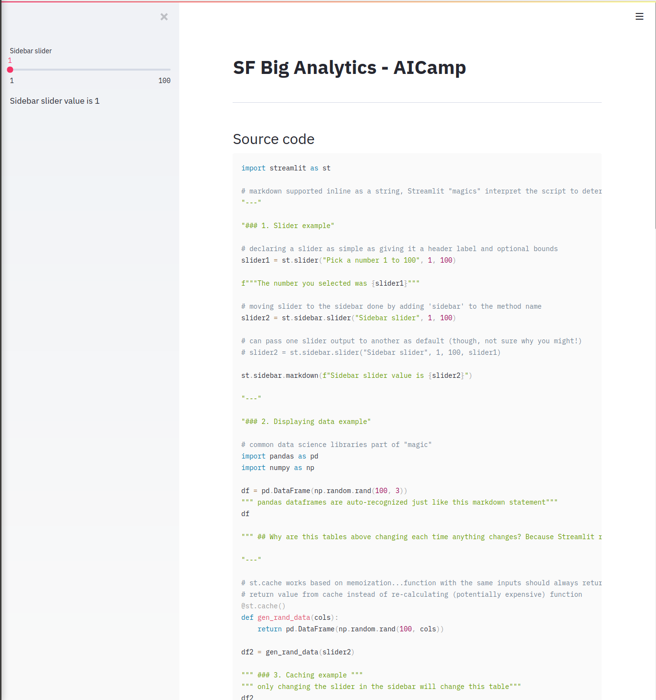
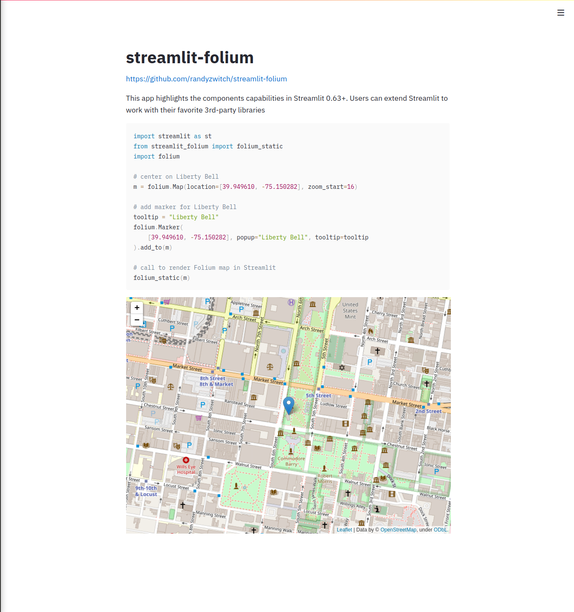

# streamlit_sfbiganalytics

[Slides](https://github.com/randyzwitch/streamlit_sfbiganalytics/blob/master/SF%20Big%20Analytics%20-%20AICamp%20-%2020200804.pdf) and code for my talk at SF Big Analytics. There are two demo Streamlit apps:
- [live_code.py](https://github.com/randyzwitch/streamlit_sfbiganalytics/blob/master/live_code.py): some/all of this is covered during the talk as a live demo
- [folium_app.py](https://github.com/randyzwitch/streamlit_sfbiganalytics/blob/master/folium_app.py): a Streamlit Components example using the [Folium](https://python-visualization.github.io/folium/) Python library

## live_code.py

## folium_app.py

